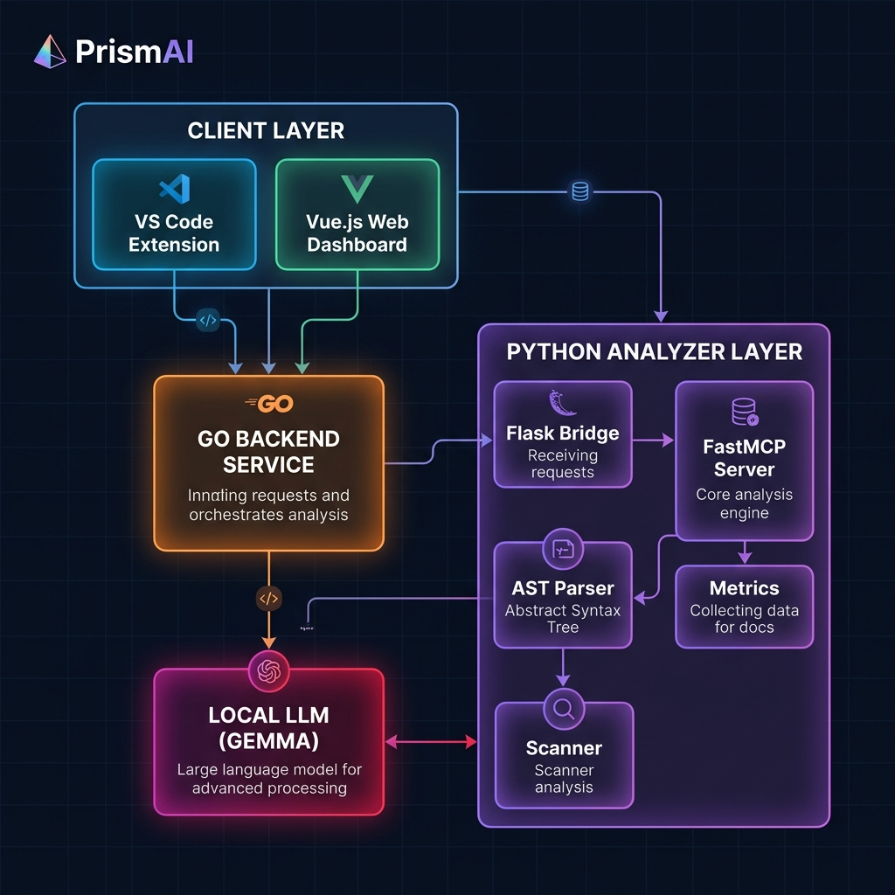
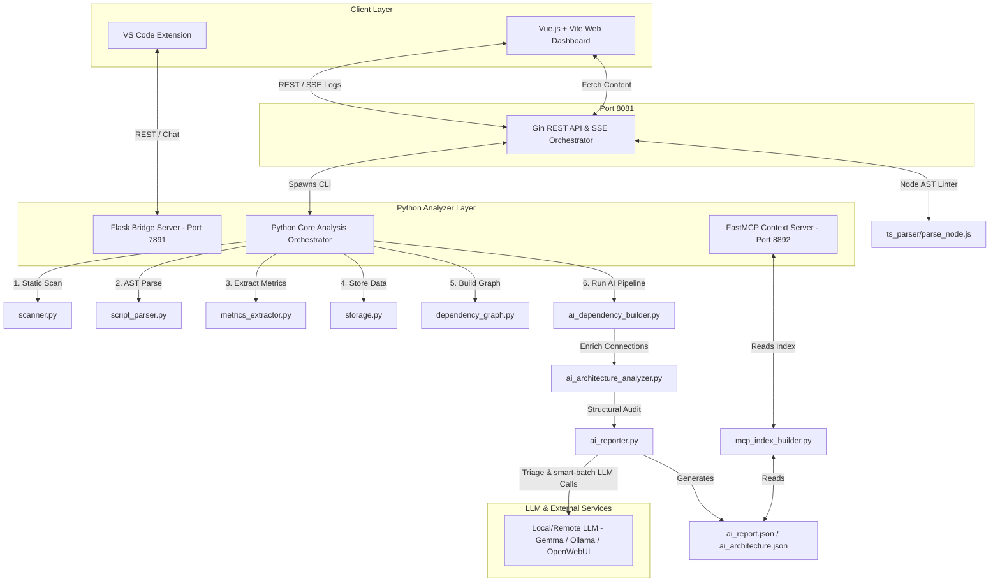
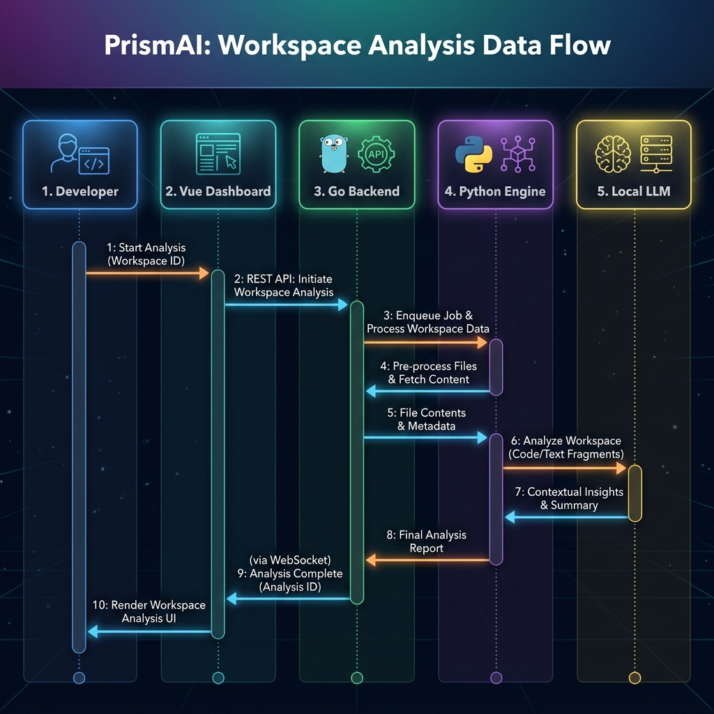
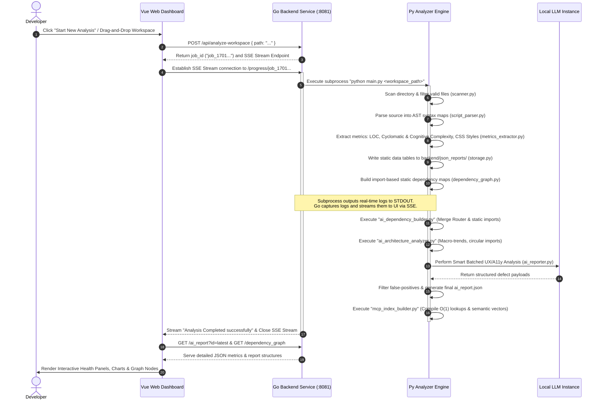
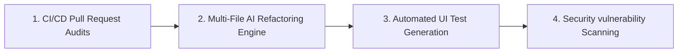

# PrismAI: Enterprise-Grade AI-Powered UI/UX, Accessibility & Intelligent Code Analysis Platform
## Complete System & Technical Architecture Documentation
### Prepared for: Engineering Management & Core Architecture Teams

---

## 1. Executive Summary & Vision 

**PrismAI** (also referred to as **Code-Analyzer**) is a next-generation developer platform designed to automate frontend application modernization. By merging **static code analysis**, **Abstract Syntax Tree (AST) parsing**, **Model Context Protocol (MCP)** context sharing, and **Large Language Models (LLMs)**, PrismAI bridges the gap between design aesthetics, accessibility standards, and code quality.

Modern frontend applications suffer from several structural and developmental fragmentations:
*   **Accessibility (a11y) Neglect:** WCAG violations (missing ARIA roles, unlabeled inputs, color contrast failures) are often caught too late in production audits.
*   **High Cognitive Complexity:** Rapid iterations lead to nested Vue/React templates, heavy API coupling, and "God Components" that are difficult to debug.
*   **Architectural Drift:** Uncontrolled imports, circular dependencies, and cross-layer contamination (e.g., low-level utils importing high-level Views) degrade long-term maintainability.
*   **Tooling Fragmentation:** Traditional linters flag errors but do not understand the underlying design principles, state-management flows, or how to *fix* them.

PrismAI solves these issues by providing a **unified multi-engine distributed environment** that acts as an automated engineering partner. It not only detects and visualizes structural defects via an interactive, reactive web dashboard but also synthesizes contextual, compiler-validated code corrections that developers can apply with a single click inside their IDE.

---

## 2. System Architecture Overview

PrismAI is designed as a modular, distributed system composed of four distinct layers:



<details>
<summary><b>Show Mermaid Source Diagram</b></summary>


</details>

### 2.1 Technology Stack & Port Allocations

| Subsystem / Layer | Technology | Primary Port | Key Responsibilities |
|---|---|---|---|
| **Central Orchestrator** | Go (Gin Framework) | `8081` | Serves static assets, manages background job queues, processes Server-Sent Events (SSE) logs, handles REST APIs, executes file-system transactions, and runs validation compilation checks. |
| **Python Flask Bridge** | Flask | `7891` | Acts as a fast real-time chat connector between the VS Code Extension and the local LLM instance. |
| **Model Context Protocol** | Python (FastMCP) | `8892` | Exposes highly structured, semantic codebase details (AST data, symbol catalogs, dependency graphs) to any LLM-enabled IDE assistant. |
| **Core Analysis Engine** | Python 3.11+ | *CLI Spawns* | Performs directory traversal, Abstract Syntax Tree (AST) compilation, accessibility scanning, metrics aggregation, and AI report synthesis. |
| **Reactive Web App** | Vue.js 3 + Vite | `5173` | Renders the high-performance analytical dashboard, interactive particle streams, live graph rendering, and the chat widget. |
| **IDE Extension** | TypeScript + VS Code API | *In-Editor* | Highlights architectural vulnerabilities directly in the text editor, offering single-click inline fixes and sidebar assistance. |

---

## 3. Core Features & Capabilities

### 3.1 Real-Time UI/UX & Accessibility Auditing
Unlike traditional static checkers, PrismAI's accessibility engine evaluates code at a layout-logical level. Using custom template parsers, it inspects elements for WCAG compliance by evaluating:
*   **ARIA Validation:** Detects click handlers on non-semantic HTML structures (e.g., clickable `div` or `span` elements) that lack explicit `role` or `aria-label` declarations.
*   **Input Labeling:** Validates that `input`, `textarea`, and `select` fields are linked to descriptive `label` tags or explicitly declared via `aria-label` properties.
*   **Media Alternative Verification:** Highlights `img` elements missing alt tags or accessible labels.
*   **Visual Simulation Audits:** Leverages LLM spatial reasoning to estimate layout usability issues, color contrast variations, and font scale hierarchies based on styling patterns.

### 3.2 Context-Aware AI-Powered Code Rectification
PrismAI implements a dual-phase analysis flow to generate highly reliable code patches:
1.  **Dual-Phase Triage (Sniffer Pass):** The system first runs files through a pure-Python heuristic analyzer (Sniffer Pass). Clean files are bypassed immediately, protecting LLM token thresholds and reducing API call latency.
2.  **Strict Context Boundaries:** For files requiring deep analysis, the system isolates exact file scopes, AST details, and import relationships. It instructs the LLM to output a strict, drop-in replacement payload (with a precise line number, defect category, severity scale, and standard Git-diff code structure).
3.  **Syntactical Self-Correction:** Before suggestions are finalized in the dashboard, the system can invoke a Node-based AST linter engine to ensure that the code changes are syntactically sound and will compile cleanly.

### 3.3 Dynamic Architectural Mapping & Dependency Blast Radius
PrismAI models the application as a directed graph where nodes represent files and edges represent static imports, registered Vue components, and Vue Router state transitions:
*   **Blast Radius Tracking:** The system traces both upstream dependencies (what a file requires to run) and downstream dependents (which files will break if this file is modified).
*   **Architectural Drift Triage:** Automatically flags cross-layer violations (e.g., low-level utils referencing high-level page views) and circular dependency loops.
*   **Centralized Fragility Detection:** Spots "God Components" (high cyclomatic/cognitive complexity paired with high downstream blast radius) that present high structural risk.

---

## 4. Architectural Data Flows & Process Orchestration

To understand how PrismAI acts as a cohesive unit, let's explore its core data flows and life-cycles.

### 4.1 Workspace Scan & AI Pipeline Execution Sequence
When a developer runs an analysis on a project directory, the Go backend coordinates with the Python engine through a background job queue:



<details>
<summary><b>Show Mermaid Source Sequence</b></summary>


</details>

---

## 5. File-by-File & Function-by-Function Codebase Deep Dive

This section provides an exhaustive guide to every code file, function, class, and algorithmic design in the PrismAI ecosystem.

---

### 5.1 Python Analyzer Engine (`/analyzer/`)

#### 5.1.1 `main.py`
The absolute entry point of the Python analysis pipeline. It handles system arguments, manages the execution order, and orchestrates static and AI components.
*   **Key Functions:**
    *   `main()`:
        *   Accepts `<path_to_workspace>` as `sys.argv[1]`.
        *   Initializes the `JSONStorage` context.
        *   Calls `scan_folder()` to map directories.
        *   Traverses files, determines if they are frontend elements, and reads their contents.
        *   Invokes `parse_source()` to obtain structural AST arrays.
        *   Invokes `get_metrics()` to compute complexity metrics, styling sheets, and layout structures.
        *   Populates database records (`insert_file`, `insert_api_call`) and triggers `run_consistency_check()`.
        *   Builds the initial `dependency_graph.py`.
        *   Triggers sequential pipeline scripts (`ai_dependency_builder.py`, `ai_architecture_analyzer.py`, `ai_reporter.py`, `mcp_index_builder.py`) using `subprocess.run()`.

#### 5.1.2 `scanner.py`
Performs robust, recursive file-system traversals.
*   **Key Functions:**
    *   `scan_folder(path)`:
        *   Traverses the directory tree using `os.walk()`.
        *   Ignores non-relevant directories (e.g., `.git`, `node_modules`, `dist`, `tests`, `temp`, `uploads`).
        *   Filters files by extensions: `.vue`, `.js`, `.ts`, `.jsx`, `.tsx`, `.html`, `.css`, `.scss`.
        *   Returns two distinct lists: `(files, folders)`.

#### 5.1.3 `script_parser.py`
Parses JS, TS, and Vue templates using regular expressions and Abstract Syntax Tree (AST) emulations.
*   **Key Functions:**
    *   `parse_source(content, file_path)`:
        *   Splits Vue files into surgical sections (Template, Script, Style).
        *   Uses regular expressions to extract imports (`import X from Y`), exports (`export const X` or `export default`), method signatures, registered local sub-components, watcher routines, and computed attributes.
        *   Identifies API endpoints (searching for Axios calls, `fetch`, or REST structures).
        *   Maps custom HTML elements to identify structural components.

#### 5.1.4 `metrics_extractor.py`
Computes all structural, complexity, and styling metrics for individual files.
*   **Key Functions:**
    *   `extract_fonts(content)` / `extract_font_sizes(content)`: Scans stylesheets or class wrappers to catalog typography elements.
    *   `extract_colors(content)`: Performs regex scans on CSS structures to extract HEX and RGB color codes, assisting the design-compliance sub-system.
    *   `extract_padding(content)` / `extract_margins(content)`: Evaluates layout consistency metrics.
    *   `extract_header_styles(content)` / `extract_alignment_info(content, elements)`: Audits header typography hierarchies.
    *   `get_metrics(file_path, tags)`:
        *   Surgically extracts Vue blocks (`<template>`, `<script>`, `<style>`).
        *   Uses `BeautifulSoup` to strip dynamic mustache elements and isolate raw visible UI texts (crucial for checking user-facing UX strings).
        *   Computes **Cyclomatic Complexity** (logical decision paths) and **Cognitive Complexity** (nested structures and conditional groupings) for script blocks.
        *   Extracts WCAG flags from AST template arrays: `missing_alt_count` (images without descriptions), `unlabeled_inputs` (interactive input fields without accessibility links), and `interactive_without_role` (click events bound to standard divs/spans without ARIA descriptors).

#### 5.1.5 `storage.py`
An in-memory relational system exported to file formats, tracking files, folders, API models, and metrics during runtime.
*   **Classes & Key Methods:**
    *   `JSONStorage`:
        *   `__init__()`: Initializes the memory schema (stores dictionaries representing tables: `projects`, `folders`, `files`, `api_calls`, `dependency_graph`, `components`).
        *   `insert_project(name)`: Adds a project record, returning an incremental primary ID.
        *   `insert_folder(project_id, name, path)`: Links directory paths to project IDs.
        *   `insert_file(folder_id, name, path, ...)`: Maps file entries with their parsed AST data, imports, exports, and metrics arrays.
        *   `insert_api_call(...)`: Registers REST hooks discovered during scans.
        *   `run_consistency_check()`: Clears broken links and normalizes schema paths.
        *   `export_all()`: Writes structural tables to disk as JSON documents in the `backend/json_reports/` directory (e.g. `files.json`, `api_calls.json`, `projects.json`).

#### 5.1.6 `dependency_graph.py`
Computes the baseline dependency matrix from file imports.
*   **Key Functions:**
    *   `build_dependency_graph(files_data, project_root)`:
        *   Resolves relative and absolute import paths to match actual file names on disk.
        *   Tracks dependencies (outgoing file connections) and builds an `impact_map` (incoming dependents).
        *   Computes circular dependencies using Tarjan's or simple depth-first path validation.
        *   Returns a structured dictionary matching the dashboard schema (`file_map`, `connections`, `impact_map`).

#### 5.1.7 `ai_config.py`
Configures the system's LLM connector. Designed to handle erratic, non-standard outputs from local LLMs (like Gemma).
*   **Key Functions & Classes:**
    *   `RateLimiter`: Implements standard delay constraints to protect local CPU loops from thread exhaustion.
    *   `get_client()`: Reads `.env` fields (`OPENWEBUI_BASE_URL`, `OPENWEBUI_API_KEY`) and constructs a standard `OpenAI` client instance with an adjusted API v1 endpoint suffix.
    *   `call_ai(client, prompt, json_mode, max_retries)`:
        *   Sends system and user inputs to the configured model (`LLM_MODEL`).
        *   Applies a highly aggressive **JSON Extraction & Repair Pipeline** to clean up the response:
            1.  *Direct Parse:* Tries to load the response directly.
            2.  *Code-Fence Extraction:* Searches for ` ```json ... ``` ` or ` ``` ... ``` ` patterns.
            3.  *Outer Brace Scanner:* Locates the outermost `{ ... }` or `[ ... ]`.
            4.  *Syntactical Patching:* Regular expressions clean up trailing commas and normalize single-quotes to double-quotes.
        *   Handles 429 rate limits, 405 endpoint mismatches, and connection issues with exponential backoff.

#### 5.1.8 `ai_context_fetcher.py`
Bridges the gap between static storage and AI analysis.
*   **Key Functions:**
    *   `fetch_all_issues_context()`:
        *   Reads `backend/json_reports/files.json` and parses it into a unified collection.
        *   For each file, reads the source code from disk and bundles it with static metrics, AST trees, and graph contexts.
        *   Returns the list of file bundles to downstream AI engines.

#### 5.1.9 `ai_dependency_builder.py`
Enriches the static import graph with dynamic route and logical dependencies.
*   **Key Functions:**
    *   `run_ai_dependency_builder()`:
        *   Loads the baseline `dependency_graph.json`.
        *   Applies standard **Regex Router Parsing** to identify Vue Router transitions (`$router.push({ name: '...' })` or `<router-link to="...">`), adding them directly to the graph as `"type": "route_navigation"`.
        *   Packs remaining source components and invokes `call_ai()` in optimized chunks (batch size 25) to uncover deeper component-to-component ties, logical bindings, and shared state structures.
        *   Re-calculates the project `impact_map` and saves the updated graphs to `json_reports/` and historical archives.

#### 5.1.10 `ai_architecture_analyzer.py`
Maps macro structural trends and architectural health.
*   **Key Functions:**
    *   `run_ai_architecture_analyzer()`:
        *   Aggregates file maps, custom imports, and existing reports.
        *   Invokes the AI engine to evaluate high-level system structures against an enterprise auditing checklist:
            1.  *Cross-Layer Contamination:* Low-level utilities referencing high-level page views.
            2.  *Circular Chains:* Dependency loops that cause memory leaks.
            3.  *State Fragility:* Prop drilling issues and structural failures.
            4.  *Centralized Fragility:* Massive "God Files" hosting too much logic.
        *   Produces a detailed `ai_architecture.json` output comprising a `project_overview`, `architectural_health_score` (0-100), system `layers`, severity-ranked `macro_trends`, and core `key_workflows`.

#### 5.1.11 `ai_reporter.py`
Coordinates the core quality and accessibility analysis pipeline.
*   **Key Functions:**
    *   `analyze_sniffer_pass(batch, client)`: A highly fast, local Python heuristic triage pass. Instantly filters out clean files based on pre-defined static markers (cyclomatic complexity < 10, nesting depth < 6, zero WCAG a11y violations, minor API usage). This bypasses the need for LLM API calls on healthy files, reducing scan times by up to 90%.
    *   `_create_smart_batches(files, max_tokens, max_files)`: Groups smaller flagged files into unified batches while isolating massive components in their own runs, optimizing token usage.
    *   `analyze_batch_sync(batch, client)`: Coordinates the prompt construction and schema validation for a batch of files. Instructs the LLM to locate only critical defects, provide exact drop-in code fixes, and generate Git-style diffs.
    *   `run_ai_reporter()`:
        *   Loads the file analysis cache (`ai_hash_cache.json`) using SHA-256 hashes of the files' contents. If a file is unchanged, the system skips it entirely.
        *   Executes the Phase 1 Sniffer Pass on all new or modified files.
        *   Spawns a multi-threaded execution pool (`ThreadPoolExecutor(max_workers=3)`) to process Phase 2 smart batches concurrently.
        *   Computes an overall code health rating (`overall_score`) using a severity-weighted penalty model (Critical: -10, High: -6, Medium: -3, Low: -1, Failed/Timeout: -5).
        *   Saves the aggregated results to `backend/ai_report.json` and a timestamped history file under `backend/json_reports/`.

#### 5.1.12 `ast_to_fingerprint.py`
A token-reduction engine that condenses raw source code into compact structural fingerprints.
*   **Key Functions:**
    *   `build_fingerprint(bundle)`:
        *   Takes an active file bundle and strips out long-form logic, comments, and boilerplate text.
        *   Generates a highly structured, text-based summary of the file's architectural profile: filename, path, complexity indices (Cognitive, Cyclomatic, LOC), template structures, prop definitions, custom event emitters (`emits`), list of internal methods, imported packages, child components, API hooks, and local styling patterns.
        *   Returns a compact fingerprint (~400 tokens instead of the typical 8,000+ token raw source file).

#### 5.1.13 `mcp_index_builder.py`
Builds an optimized, O(1) queryable search index for Model Context Protocol consumers.
*   **Key Functions:**
    *   `_build_symbol_index(files_data)`: Creates lookup tables mapping every exported variable, imported function, local utility, and Vue component back to its source file ID.
    *   `_compute_semantic_vector(text)`: Generates semantic vector representations of files using token-hashing algorithms and cosine-similarity structures.
    *   `build_mcp_index()`:
        *   Reads all static files, API logs, and AI reports.
        *   Compiles folders, files, symbols, metrics, and dependency paths into a unified, high-performance lookup system saved at `backend/json_reports/mcp_index.json`.
        *   Calculates global project metrics (e.g., average cyclomatic complexity, total LOC, API density, and extensions distribution).

#### 5.1.14 `mcp_server.py`
A Model Context Protocol (MCP) server built with Python's FastMCP framework, exposing codebase analysis structures as tools and resources.
*   **Key Tools & Resources:**
    *   `list_files(filter)`: Lists analyzed files, optionally filtered by glob patterns.
    *   `get_file_detail(file_name, file_id)`: Fetches structural AST details, metrics, imports, and exports for a file.
    *   `get_file_source(file_name, file_id, max_lines, offset)`: Serves paginated, line-numbered source code.
    *   `get_dependency_graph(file_id)`: Exposes dependency connections and structural blast-radius reports.
    *   `search_by_symbol(symbol)`: Instantly locates the files where a symbol is defined or imported.
    *   `search_semantic(query, top_k)`: Performs cosine-similarity searches to locate relevant files based on natural language queries.
    *   `get_blast_radius(file_id, depth)`: Computes the upstream and downstream impact of modifying a specific file.
    *   `get_ai_report(file_id)`: Returns AI defect lists and remediation details.
    *   `get_architecture()`: Serves high-level layers, workflows, and trend data.
    *   `reload_index()`: Force-reloads the in-memory index after a new scan is executed.
    *   *Resources:* Exposes read-only telemetry endpoints via `prismai://project/overview`, `prismai://files`, `prismai://dependencies`, and `prismai://metrics`.

#### 5.1.15 `analysis_server.py`
A lightweight Flask API server serving the VS Code Extension.
*   **Key Endpoints:**
    *   `POST /chat`:
        *   Accepts prompt queries, active file names, system history, and issue details.
        *   Gathers the relevant codebase context and connects directly to the local LLM.
        *   Formulates a professional response explaining the bug's root cause, offering remediation tips, and evaluating the safety of the proposed fix.
    *   `GET /health`: Returns the status of the connection.

---

### 5.2 Go Orchestration Backend (`/backend/`)

#### 5.2.1 `main.go`
The system's central orchestration engine. Built with the **Gin Web Framework**, it handles concurrency, processes file transactions, streams analysis logs, and runs syntax verification builds.
*   **Key Structures:**
    *   `Job`: Tracks background runs (`ID`, `Status`, `ErrorMsg`, list of string `Logs`, and channels for Server-Sent Events clients).
*   **Key Core Orchestrators:**
    *   `updateJobStatus(jobID, status, errMsg)`: Safely updates job states under mutex locks. If a job is finished or runs into an error, it closes active SSE channels.
    *   `appendJobLog(jobID, line)`: Appends stdout/stderr console lines to active job histories and broadcasts them to all listening client streams.
    *   `runAnalysisJob(jobID, path)`:
        *   Invokes the core Python analyzer script as a background process: `python ../analyzer/main.py <path>`.
        *   Captures combined stdout/stderr streams using a scanner loop and pipes the output directly to `appendJobLog()`.
    *   `runBuildJob(jobID, filePath)`:
        *   Checks for an npm project context (searching upwards from the file's directory for a `package.json` file).
        *   If found, it runs a background build command (`npm run build`) in that directory and streams the compiler logs to the UI.
        *   If no npm context is found, it falls back to a high-speed linter syntax check, invoking `node ../analyzer/ts_parser/parse_node.js <filePath>` and parsing its JSON payload to verify the code's integrity.
*   **Key REST API Endpoints:**
    *   `GET /file-content?path=...`: Surgically reads files from disk (supports relative, absolute, and nested directory paths) and serves them as raw strings.
    *   `POST /upload`: Handles zip/file uploads, writes them to `/uploads`, and triggers a synchronous python analysis process.
    *   `POST /api/analyze-workspace`: Initiates a background workspace analysis job (`runAnalysisJob`) and returns the job ID.
    *   `GET /status/:job_id` / `GET /progress/:job_id`: Stream-pipes real-time analysis console lines using standard Server-Sent Events (SSE).
    *   `GET /api/history`: Scans `json_reports/ai_report_*.json` and compiles historical logs (scores, date, issues) for the dashboard.
    *   `GET /ai_report` / `GET /ai_architecture` / `GET /dependency_graph`: Serves generated JSON files directly from disk.
    *   `POST /api/save-file`: Accepts a file path and a code string, saving the modified content back to the file system.
    *   `POST /api/run-build`: Triggers a compiler or high-speed AST linter syntax check (`runBuildJob`).
    *   `NoRoute`: Automatically falls back to `/dist/index.html` to support Vue HTML5 History Mode routing.

---

### 5.3 Vue.js + Vite Web Dashboard (`/frontend/`)

#### 5.3.1 `App.vue`
The layout shell of the dashboard. It manages global states, sidebar navigations, active page selections, workspace registrations, and handles full-screen report loads.

#### 5.3.2 `Dashboard.vue`
The primary system dashboard. Renders high-level project health details with premium design patterns.
*   **Features & Visual Components:**
    *   *Interactive Hero Canvas:* Implements a interactive canvas particle network. Generates particle arrays with physical vectors, draws connection lines based on node distances, and applies gravitation forces pulling particles toward the user's cursor.
    *   *Circular SVG Progress Gauge:* Computes and renders overall quality scores with smooth dash-offset path strokes.
    *   *Severity Breakdown Panel:* Displays interactive critical, high, medium, and low issue counts on card hover.
    *   *Project Reports Grid:* Includes interactive sorting (by project name, score, issues count, or date) and search filters.
    *   *Enterprise CI/CD Hook:* Includes a simulated GitHub webhook connection drawer.

#### 5.3.3 `ChatWidget.vue`
An inline chat assistant enabling interactive discussions on codebase structures and defects.
*   **Key Methods & Logic:**
    *   `loadHistory()` / `saveHistory()`: Persists chat histories locally under project-specific keys (`localStorage`).
    *   `sendMessage()`:
        *   Builds custom payloads including prompt messages, context types, active file structures, recent history, and attached issue models.
        *   Dispatches payloads to the Python Flask Bridge server (`:7891/chat`) and renders the markdown assistant responses.
    *   `attachIssueFromPicker(issue)`: Links a specific defect from the system issues panel to the active chat session.
    *   `sendIssueToChat(issue)`: Assembles structural details (issue type, file, line number, WCAG rule, suggestion, and fixed code block) into a cohesive query, automatically sending it to the assistant to initiate a debugging session.

#### 5.3.4 `FileTree.vue`
Renders the workspace file system as an interactive, expandable tree. Allows developers to select specific files, view their static metric lists, and load detailed code views directly.

---

## 6. Comprehensive Installation & Setup Manual

Follow this step-by-step setup guide to initialize PrismAI on a clean Windows machine.

### 6.1 Prerequisites
Verify that the following runtimes are installed and available in your system path:
1.  **Go:** Version 1.20 or newer (`go version`).
2.  **Python:** Version 3.11 or newer (`python --version`).
3.  **Node.js:** Version 18 or newer (`node --version`).
4.  **PowerShell:** Standard terminal (with execution permissions allowed for local script runs).

### 6.2 Environment Configuration
Create a `.env` file in the root directory:

```env
OPENWEBUI_BASE_URL=http://localhost:8080
OPENWEBUI_API_KEY=sk-your-premium-api-key-here
LLM_MODEL=gemma2:9b
USE_JSON_MODE=false
```

> [!NOTE]
> If you are using a local Ollama instance directly without OpenWebUI, point the `OPENWEBUI_BASE_URL` to `http://localhost:11434` and configure the model name accordingly (e.g. `gemma2:9b`).

### 6.3 Dependency Installation

#### 6.3.1 Python Dependencies
Navigate to the `/analyzer/` directory and install the required modules:

```powershell
cd analyzer
pip install -r requirements.txt
```

*The dependencies include:* `openai`, `flask`, `flask-cors`, `mcp`, `beautifulsoup4`, `python-dotenv`, and `sentence-transformers` (optional for local embeddings).

#### 6.3.2 Frontend Dependencies
Navigate to the `/frontend/` directory and install the npm packages:

```powershell
cd ../frontend
npm install
```

### 6.4 Building the System

#### 6.4.1 Compile the Go Binary
Compile the Go backend to produce the native execution binary:

```powershell
cd ../backend
go build -o Analyzer.exe main.go
```

#### 6.4.2 Compile the Frontend Dashboard Assets
Build the production build of the Vue.js dashboard application:

```powershell
cd ../frontend
npm run build
```

Once the compilation completes, Vite will output the assets to `/frontend/dist`. Copy this entire `dist` directory into `/backend/dist` so the Go server can host and serve the dashboard natively on port 8081:

```powershell
# Copy built assets to the Go backend folder
Copy-Item -Path "dist" -Destination "../backend/dist" -Recurse -Force
```

---

## 7. Operational Manual: Running the Platform

### 7.1 Unified Power Launcher
PrismAI includes a unified PowerShell script (`start.ps1`) that orchestrates all sub-services together. It handles background processes, assigns working directories, and intercepts interrupt calls to terminate child tasks cleanly.

To launch the entire platform, run the following command from the root directory:

```powershell
.\start.ps1
```

The launcher will spin up the processes and print their status:
```text
Starting services...
  [OK] Backend started (PID: 8432)
  [OK] Frontend started (PID: 10424)
  [OK] MCP Server started on :8892 (PID: 5412)
  [OK] Flask Server started on :7891 (PID: 1290)
Press Ctrl+C to stop...
```

### 7.2 Service Endpoints Check
Verify that the services are active by visiting their local endpoints:
*   **Web Dashboard Portal:** [http://localhost:8081](http://localhost:8081)
*   **Vite Dev Server (Frontend HMR):** [http://localhost:5173](http://localhost:5173)
*   **Python Flask Chat Connector:** [http://localhost:7891/health](http://localhost:7891/health)
*   **Model Context Protocol (HTTP):** [http://localhost:8892](http://localhost:8892)

---

## 8. VS Code Extension Setup & Packaging

The IDE Extension connects the local PrismAI core to the developer's workspace.

### 8.1 Build & Package VSIX
1.  Navigate to the extension directory:
    ```powershell
    cd uiux-copilot-extension
    ```
2.  Install dependencies:
    ```powershell
    npm install
    ```
3.  Package the extension into a standard VSIX file using VSCE:
    ```powershell
    npx vsce package
    ```
    This generates a file named `uiux-copilot-0.0.1.vsix`.

### 8.2 IDE Installation
Install the VSIX package directly into your VS Code instance:

```powershell
code --install-extension uiux-copilot-0.0.1.vsix
```

Once installed, open the VS Code settings and verify that the extension is configured to connect to your local Go backend service on port `8081` and the Flask bridge on port `7891`.

---

## 9. Future Roadmap & Strategic Vision

As PrismAI evolves, several enterprise integrations are planned to expand its analytical capabilities:

<div style="display: flex; gap: 1rem; flex-wrap: wrap; margin: 1.5rem 0; justify-content: center; align-items: stretch; font-family: sans-serif;">
  <div style="flex: 1; min-width: 200px; padding: 1.25rem; background: #0f172a; border: 1px solid #1e293b; border-radius: 8px; text-align: center; box-shadow: 0 4px 6px -1px rgba(0,0,0,0.1);">
    <div style="font-weight: bold; color: #38bdf8; margin-bottom: 0.5rem; font-size: 1.1rem;">1. CI/CD Audits</div>
    <div style="font-size: 0.875rem; color: #94a3b8;">Automated gates blocking PRs containing critical WCAG accessibility or dependency issues.</div>
  </div>
  <div style="display: flex; align-items: center; justify-content: center; color: #475569; font-weight: bold; font-size: 1.5rem;">➔</div>
  <div style="flex: 1; min-width: 200px; padding: 1.25rem; background: #0f172a; border: 1px solid #1e293b; border-radius: 8px; text-align: center; box-shadow: 0 4px 6px -1px rgba(0,0,0,0.1);">
    <div style="font-weight: bold; color: #818cf8; margin-bottom: 0.5rem; font-size: 1.1rem;">2. AI Refactoring</div>
    <div style="font-size: 0.875rem; color: #94a3b8;">Multi-file automated codebase reorganization and state optimization.</div>
  </div>
  <div style="display: flex; align-items: center; justify-content: center; color: #475569; font-weight: bold; font-size: 1.5rem;">➔</div>
  <div style="flex: 1; min-width: 200px; padding: 1.25rem; background: #0f172a; border: 1px solid #1e293b; border-radius: 8px; text-align: center; box-shadow: 0 4px 6px -1px rgba(0,0,0,0.1);">
    <div style="font-weight: bold; color: #c084fc; margin-bottom: 0.5rem; font-size: 1.1rem;">3. UI Test Gen</div>
    <div style="font-size: 0.875rem; color: #94a3b8;">Translating architectural/UX defects into Cypress & Playwright scripts.</div>
  </div>
  <div style="display: flex; align-items: center; justify-content: center; color: #475569; font-weight: bold; font-size: 1.5rem;">➔</div>
  <div style="flex: 1; min-width: 200px; padding: 1.25rem; background: #0f172a; border: 1px solid #1e293b; border-radius: 8px; text-align: center; box-shadow: 0 4px 6px -1px rgba(0,0,0,0.1);">
    <div style="font-weight: bold; color: #f43f5e; margin-bottom: 0.5rem; font-size: 1.1rem;">4. Security Scans</div>
    <div style="font-size: 0.875rem; color: #94a3b8;">Detecting raw html injection risks, vulnerable packages, and secret leaks.</div>
  </div>
</div>

<details>
<summary><b>Show Mermaid Source Flowchart</b></summary>


</details>

1.  **Automated CI/CD Gatekeeping:** Integrate PrismAI directly into GitHub Actions or GitLab pipelines to block pull requests containing critical WCAG a11y violations or high circular dependency counts.
2.  **Multi-File AI Refactoring Engine:** Enable the system to rewrite and refactor complex, multi-file modules automatically, reducing prop-drilling by restructuring stores.
3.  **Automated UI Test Generation:** Translate discovered visual and interactive defects into standard end-to-end test cases (using Playwright or Cypress) to prevent regressions.
4.  **Security Vulnerability Scanning:** Expand AST scanning rules to flag potential frontend vulnerabilities, such as unsafe HTML injections (`v-html`), exposed API keys, or weak cryptography models.

---

### Document Metadata
*   **Version:** 1.0.0
*   **Document Hash:** 8f12a9c3d4f9b8c0e2a3
*   **Author:** PrismAI Principal Architect
*   **Classification:** Technical Architecture & Deployment Documentation (Confidential)
